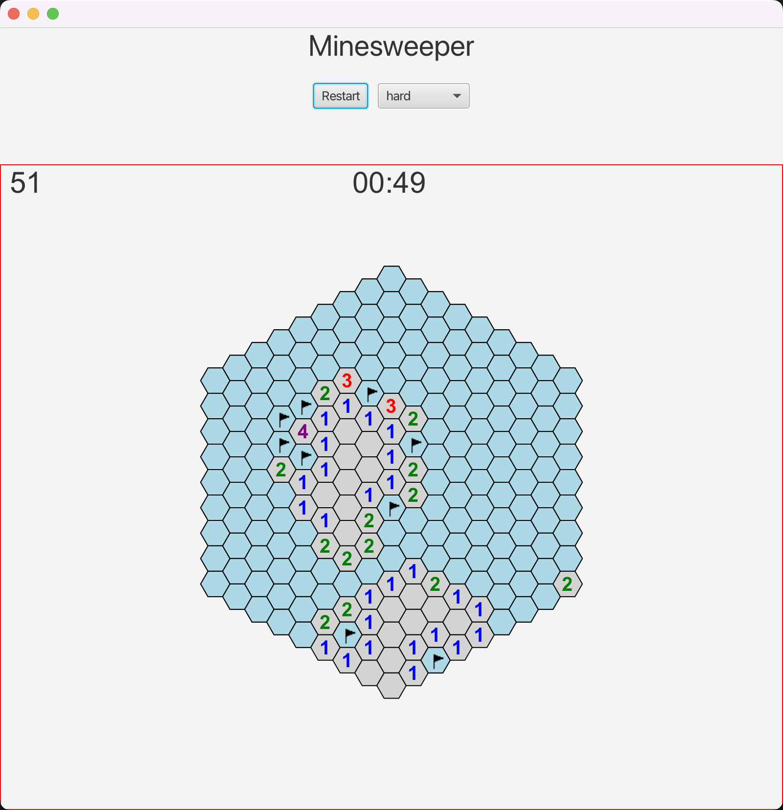

# Hexagon Minesweeper Game

Welcome to the Hexagon Minesweeper Game repository! This project is a JavaFX implementation of the classic Minesweeper game, using a hexagonal grid layout to add a unique twist to the gameplay.

## Features

- Hexagonal grid layout with interactive hexagon cells
- Minesweeper gameplay mechanics
- Difficulty levels: Easy, Medium, Hard, and Extreme
- Timer to track your game duration
- Flagging functionality to mark potential mine locations
- Restart the game with a single click
- Dynamic mine count display

## Getting Started

### Prerequisites

- Java Development Kit (JDK)
- JavaFX library
- Gradle build tool

### Installation

1. Clone the repository to your local machine.
2. Open a terminal or command prompt and navigate to the project directory.
3. Run the application in Gradle

## How to Play

1. Start the game with difficulty level default to medium, or choose a difficulty level from the dropdown menu.
1. Left-click a hexagon to reveal its content. Avoid mines!
1. Right-click a hexagon to place a flag on a potential mine location.
1. Win the game by revealing all non-mine cells or lose by hitting a mine.

## Screenshots

