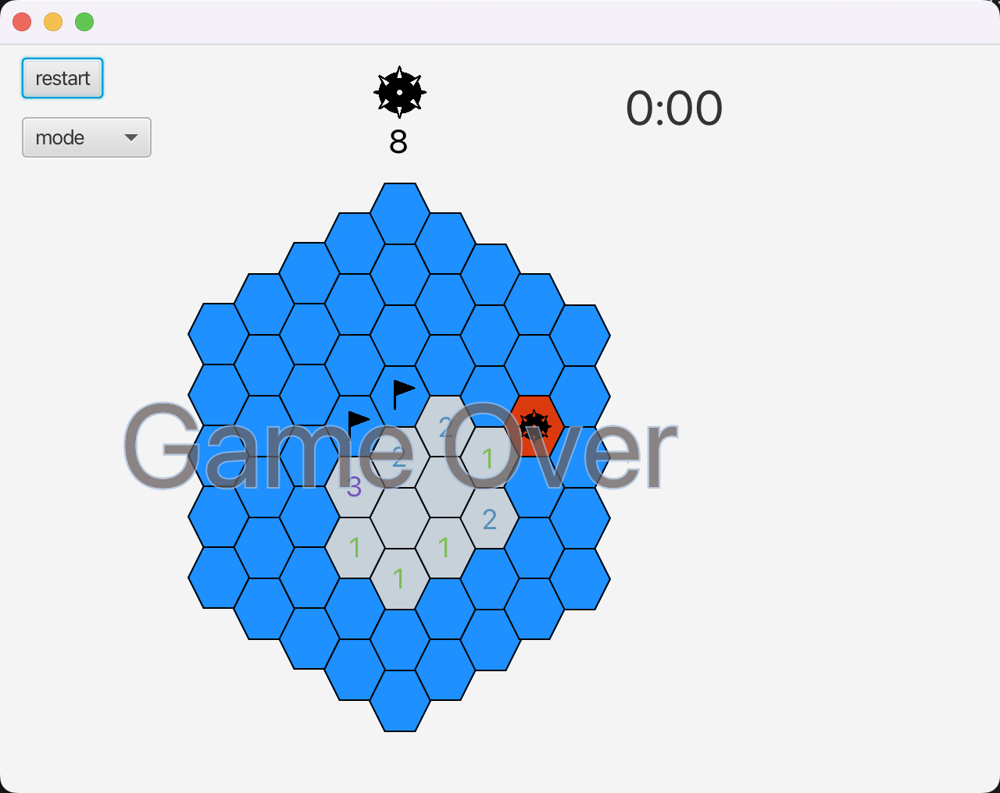

[](https://classroom.github.com/online_ide?assignment_repo_id=11517060&assignment_repo_type=AssignmentRepo)

# Final Project 📖📚✍️✅💯🎓

Objectives:

In this project you will:

- Demonstrate your mastery of OOD to solve a challenging problem
- Design a solution with MVC architecture with JavaFX
- Apply all (or most) of the programming concepts used in this course
- Use design patterns to raise cohesion and lower coupling as well as to avoid re-inventing the wheel
- Meet objectives of prior assignments

## On Groups

This project can be completed individually or with a group of up to three (3) people. If the latter, the work done must be worthy of the additional personnel i.e. if one student could have completed this by themselves then the final grade will be halved (or by two-thirds).

## Part 1: The Idea

Think of three (3) real problems that excite you. Consider for example:

- a problem that you're encountering at work
- an issue that you run into daily in your usual routine
- a CS problem that sparks your curiosity
- a challenge from when you were an undergraduate
- a new unique game you want to develope

This project is a culmination of all of you've learned in this class including Object-Oriented Design, Testing, UML, Design Patterns, and most importantly is a showcase for MVC requiring JavaFX.

Should you want to do some data visualization (like with NumPy or Pandas in Python) a widely used tool for Java is [JFreeChart](https://www.jfree.org/jfreechart/samples.html). This tool is not a replacement for JavaFX but can be used to create images that can be loaded into JavaFX.

If you're working with a team - each member should come up with three (3) unique ideas.

Share your ideas on a private Piazza post, visible to the Instructors and the other members of your team, _by the date listed in Canvas_. We will discuss with you the feasiblity and difficulty of implementing each idea, raising the bar if the problem is too simple, or lowering it if too complicated. If an idea you selected already has many examples online, like on StackOverflow, we will veto it. Finally, we'll recommend to the group which idea would make for the best project. If you dislike any requirements that we add, your group can suggest new ideas until all parties are satisfied.

You cannot proceed to Part 2 until Part 1 is approved.

## Part 2: The Design

This is where you will design a UML Class Diagram that your team will submit here on this README.md written in Mermaid. Use every tool to ensure that the system that you design follows proper OOD principles, is well organized, appears highly cohesive, and lously coupled. Your use of Design Patterns needs to be indicated with UML Notes as part of the diagram.


The second half of this part is a mock-up of what you want your application to look like using [SceneBuilder](https://gluonhq.com/products/scene-builder/). Add these .fxml files to the repo and include screenshots of your renderings below.

Before the game starts:


During the game:


Game over:


No actual Java code will be written for this part. Submit everything by the date identified on Canvas. The teaching teach will provide rapid feedback on your diagram and Views. You can move on to Part 3, just be aware that you may need to change things if the Teaching Team finds issues.

## Part 3: Implementation

A failure to plan is a plan to fail -- but you've done all of the planning, now is the time to build it 😎

There is also a codewalk where you will meet with the Instructors to go over your mostly completed application and get feedback all aspects, including design, Views, missing components, etc., that will need to be addressed before submitting a final result.

## Documentation and Testing

Your project needs to follow the Google style format and reach 70% code coverage from your testing on components not related to the View/Control. You are expected to show a screenshot from your JaCoCo coverage report below, identifying the level of code coverage.

```markdown
Image Rendering Syntax:


Example:

```

// add your screenshot here


## UML & Design Patterns

// add final UML Class Diagram written in Mermaid here. This is the new version of the UML but leave the old version in the earlier section.

```mermaid
classDiagram

    class App {
        +start(Stage: stage): void
        +setRoot(String fxml): void
        +loadFXML(String fxml): void
        +main(String[]): void
    }

    class Difficulty{
    <<enumeration>>
    EASY
    MEDIUM
    HARD
    EXTREME
}

    class Controller{
        -gameDifficulty: Difficulty
        -seconds: int
        -countDisplay: Label
        -timeline: Timeline
        -root: VBOX
        -boardContainer: Pane
        -gameBoard: GameBoard
        -difficultyDropdown: ComboBox

        +initialize(): void
        +restartGame(): void
        +setDifficulty(): void
        +handleHexagonClick(event: MouseEvent, gameBoard: GameBoard)
        +displayMineCount(mineCount: int)
        +resetTimer(): void
        +convertToMinuteSeconds(seconds: int)

    }


    class GameBoard {
        -size: int
        -hexCells: List
        -mineCount: int
        -gameStopped: boolean
        +generateCells(): List
        +getCellList(): List
        +colCount():int
        +cellCountIncCol(x: int): int
        +highestColCount(): int
        +distributeMines(totalMines：int): void
        +labelNeighbors(): void
        +getNeighbors(cell: HexCell): list
        +isCellValid(col: int, row: int): boolean
        +revealCell(cell: HexCell): void
        +checkWin(): boolean
        +endGame(win: boolean): void
        +getSize(): int
        +getMineCount(): int
        +setMineCount(n: int): void
        +isGameStopped(): boolean
        +setGameToStop(): void


    }


    class HexCell {
        -x: int
        -y: int
        -gameBoard: GameBoard
        -RADIUS: int
        -hasMine : boolean
        -isRevealed: boolean
        -isHidden: boolean
        -isFlagged: boolean
        -baseCell: Polygon
        -cellCover: Polygon
        -neighborMineCount: Label
        -mineImg: Image
        -mineImgView: ImageView
        -flagImg: Image
        -flagImgView: ImageView

        +getMineImg(): Image
        +getFlagImg(): Image
        +createHexagon(x: double, y: double): Polygon
        +createBaseCell(x: double, y: double): Polygon
        +createCellCover(x: double, y: double): Polygon
        +getActualCoordinates(col: int, row: int): []
        +getXOffset(): double
        +getYOffset(): double
        +getSideLength(): double
        +getHexWidth(): double
        +getHexApothem(): double
        +hasMine(): boolean
        +isRevealed(): boolean
        +isFlagged(): boolean
        +neighborMinesCount(): int
        +hasNeighborMines(): boolean
        +addMine(): void
        +flag(): void
        +unflag(): void
        +toggleFlag(): void
        +reveal(): void
        +getMineImgView(): ImageView
        +getCellCover(): Polygon
        +getBaseCell(): Polygon
        +getCol(): int
        +getRow(): int
        +getNeighborMineCount(): int
        +ifContainsMouseXY(mouseX: double, mouseY: double):boolean
    }

    Controller "1" --* "1" GameBoard
    GameBoard "1" --* "n" HexCell


```



Also fill in the table below explaining the design patterns that you used in your application.

| Pattern Name | Class(es)              | Justification                                                                                                                                                                                                                                                                                                                            |
| :----------: | ---------------------- | :--------------------------------------------------------------------------------------------------------------------------------------------------------------------------------------------------------------------------------------------------------------------------------------------------------------------------------------- |
|  Singleton   | `GameBoardTest`        | In the GameBoardTest class, the Platform.startup() is called within the @BeforeAll method, which ensures that the JavaFX platform is started only once for the entirety of the test suite. This simulates the Singleton pattern's characteristic as the platform's initialization is controlled and restricted to one singular instance. |
|   Factory    | `GameBoard`            | The GameBoard class uses a switch-case based on the Difficulty enum to decide the size and mineCount for the game. This mechanism abstracts the instantiation logic from the caller, allowing the creation of a GameBoard tailored to the provided difficulty.                                                                           |
|  Composite   | `HexCell`, `GameBoard` | The GameBoard class contains a 2-dimensional list of HexCell objects. The entire board (composite) is made up of individual cells (components), allowing operations to be performed on the board as a whole or on individual cells.                                                                                                      |
|   Observer   | `Controller`           | In Minesweeper, the UI may need to update in response to game state changes. For example, when a cell is clicked, several other parts of the UI might need updating: a counter for remaining mines, a timer, or even just changing the appearance of the clicked cell.here                                                               |
|   Strategy   | `Difficulty`           | Different algorithms or strategies could evaluate the game state based on the game's difficulty. For instance, the logic to determine a win in an 'EASY' game might differ from a 'HARD' game. By encapsulating these strategies, the game logic can seamlessly shift between them based on the difficulty.                              |

## Reflection

Each member of your group needs to provide an answer to _each_ question and be sure to clearly identify whose response is whose.

1. Describe one lesson from this course and how it impacted this project.

   Nuo Xu: This course emphasized the significance of design patterns, and I've witnessed its practicality in this project. By implementing patterns like Factory and Singleton, the Minesweeper game's code became more modular, maintainable, and extensible. It also ensured that the design was more aligned with industry best practices.

   Xin Geng: The component based UI programming paradigm. It has impacted this project by promoting modularity, separation of concerns, reusability, and maintainability. It has helped me create a structured and organized codebase while providing a flexible and scalable architecture for building complex UIs.

2. What part of this assignment did you find the most challenging and why?

   Nuo Xu: The test is the most chanllenging because the JavaFx and the basic logic is mixed so I need to learn more things to build initial board to test

   Xin Geng: Converting coordinates in a hexagon grid was challenging because the hexagonal grid introduces a unique coordinate system where cells are arranged in a hexagonal pattern and involves a mix of mathematical concepts, careful coding, and thorough testing.

3. Assume that you are doing this project over again, what element(s) would you change and how?

   Nuo Xu: If I were to redo this project, I would consider introducing a more robust Observer pattern for the UI components. This way, any changes in the game state, like revealing a cell or marking a mine, would automatically update relevant UI components. It would decouple the UI logic from the game mechanics, leading to cleaner and more maintainable code.

   Xin Geng: I would try to ensure that each component has a clear and single responsibility. For instance, the GameBoard class could focus solely on managing the game state and rules, while UI-related logic resides in the UI-related classes.

4. How did the process of this assignment, specifically completing Part 2 before starting Part 3, impact your learning?

   Nuo Xu: I learn alot about to crate a big picure before start project. Creating the UML diagrams in Part 2 before diving into the coding in Part 3 solidified the importance of planning and design in software development. The UML diagrams acted as blueprints, allowing for a clear visualization of the game's architecture, relationships, and flow. This preparatory step made the coding phase more streamlined and structured. Instead of navigating through uncertainties during coding, I had a clear path to follow. This reinforced that spending time in the design phase can save significant time and potential rework during the implementation phase.

   Xin Geng: It was a great roadmap for approaching a project like the hexagon minesweeper from scratch. Starting with a clear understanding of the project's requirements and goals, breaking down the design into components, and gradually implementing and refining the system using object-oriented design principles can lead to a successful and well-structured project.

5. Think back on what you knew before starting this course and what you know now. What advice would you tell your younger self having completed this project?

   Nuo Xu: Looking back, I would tell my younger self to never underestimate the power of well-structured and organized code. While initially, it might seem tedious to implement design patterns and best practices, in the long run, it saves tremendous time and effort, especially during maintenance or when scaling the application. Also, always focus on the fundamentals, as a deep understanding of core concepts will make advanced topics more approachable and understandable.

   Xin Geng: I would tell my younger self that mastering object-oriented design takes time and practice. Don't hesitate to start with simple projects and gradually tackle more complex ones. Each project will provide valuable lessons and contribute to the growth as a software developer.

## Accountability

In this section, identify who worked on what parts.

Xin Geng: HexCell.java, Controller.java and other javafx related components.
